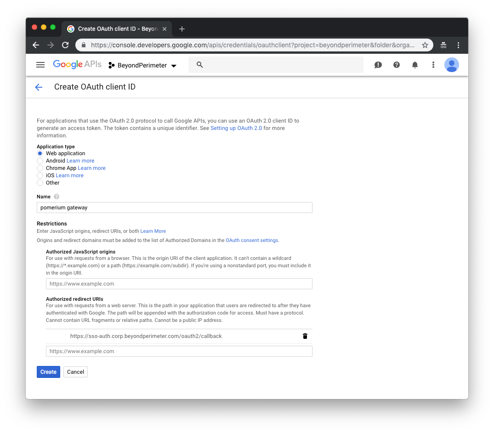
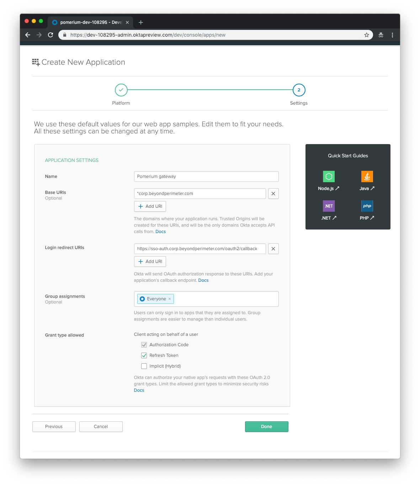
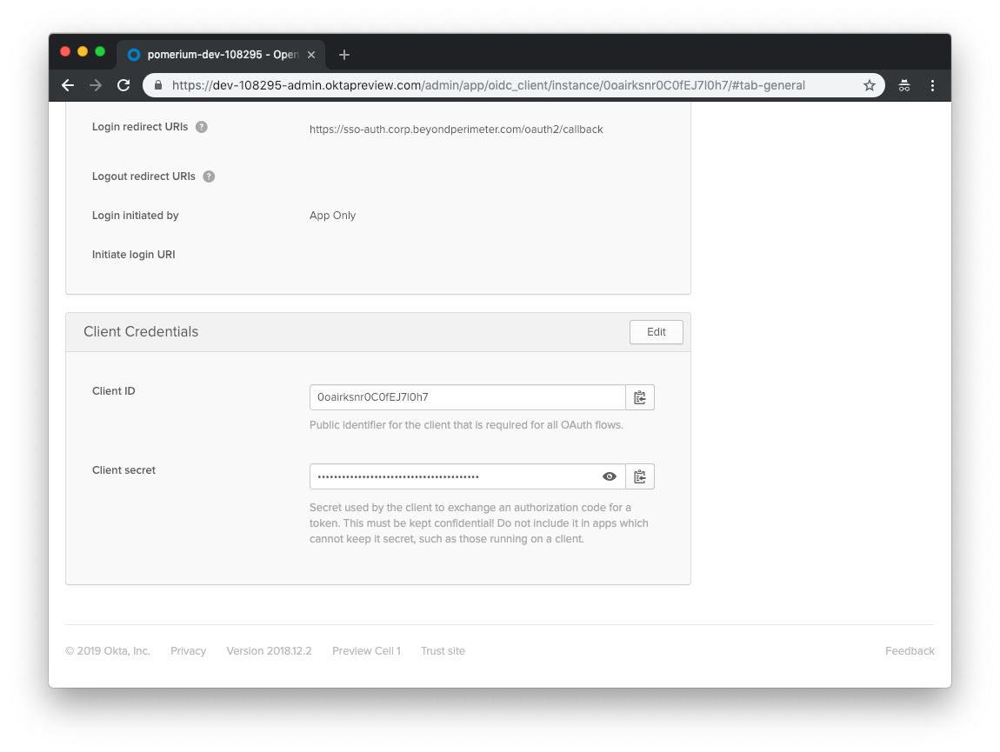

# Identity Provider Configuration

This article describes how to configure pomerium to use a third-party identity service for single-sign-on.

There are a few configuration steps required for identity provider integration. Most providers support [OpenID Connect] which provides a standardized interface for authentication. In this guide we'll cover how to do the following for each identity provider:

1. Establish a **Redirect URL** with the identity provider which is called after authentication.
1. Generate a **Client ID** and **Client Secret**.
1. Configure pomerium to use the **Client ID** and **Client Secret** keys.

## Google

Log in to your Google account and go to the [APIs & services](https://console.developers.google.com/projectselector/apis/credentials). Navigate to **Credentials** using the left-hand menu.


On the **Credentials** page, click **Create credentials** and choose **OAuth Client ID**.


On the **Create Client ID** page, select **Web application**. In the new fields that display, set the following parameters:

| Field                    | Description                               |
| ------------------------ | ----------------------------------------- |
| Name                     | The name of your web app                  |
| Authorized redirect URIs | `https://${redirect-url}/oauth2/callback` |



Click **Create** to proceed.

Your `Client ID` and `Client Secret` will be displayed:


Set `Client ID` and `Client Secret` in Pomerium's settings. Your [environmental variables] should look something like this.

```bash
export REDIRECT_URL="https://sso-auth.corp.beyondperimeter.com/oauth2/callback"
export IDP_PROVIDER="google"
export IDP_PROVIDER_URL="https://accounts.google.com"
export IDP_CLIENT_ID="yyyy.apps.googleusercontent.com"
export IDP_CLIENT_SECRET="xxxxxx"
```

## Okta

[Log in to your Okta account](https://login.okta.com) and head to your Okta dashboard. Select **Applications** on the top menu. On the Applications page, click the **Add Application** button to create a new app.


On the **Create New Application** page, select the **Web** for your application.


Next, provide the following information for your application settings:

| Field                        | Description                                           |
| ---------------------------- | ----------------------------------------------------- |
| Name                         | The name of your application.                         |
| Base URIs (optional)         | The domain(s) of your application.                    |
| Login redirect URIs          | `https://${redirect-url}/oauth2/callback`.            |
| Group assignments (optional) | The user groups that can sign in to this application. |
| Grant type allowed           | **You must enable Refresh Token.**                    |



Click **Done** to proceed. You'll be taken to the **General** page of your app.

Go to the **General** page of your app and scroll down to the **Client Credentials** section. This section contains the **Client ID** and **Client Secret** to be used in the next step.


At this point, you will configure the integration from the Pomerium side. Your [environmental variables] should look something like this.

```bash
export REDIRECT_URL="https://sso-auth.corp.beyondperimeter.com/oauth2/callback"
export IDP_PROVIDER="okta"
export IDP_PROVIDER_URL="https://dev-108295-admin.oktapreview.com/"
export IDP_CLIENT_ID="0oairksnr0C0fEJ7l0h7"
export IDP_CLIENT_SECRET="xxxxxx"
```

[environmental variables]: https://en.wikipedia.org/wiki/Environment_variable
[oauth2]: https://oauth.net/2/
[openid connect]: https://en.wikipedia.org/wiki/OpenID_Connect
